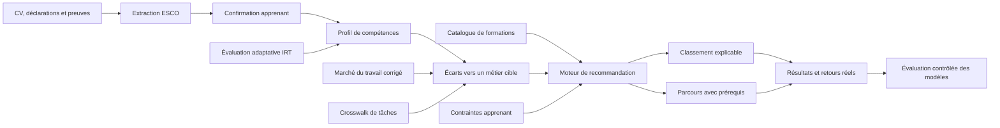

# PRAXIS — exploration professionnelle et développement des compétences

PRAXIS est une application locale d’exploration professionnelle et un moteur TypeScript autonome. Le parcours apprenant permet de décrire son point de départ, explorer plusieurs directions, les comparer, comprendre les compétences à développer ou à clarifier, puis choisir une première action. Le moteur de recommandation de formations reste disponible comme composant optionnel.

Le dépôt contient le cœur technique de PRAXIS, son schéma PostgreSQL, une interface locale pour apprenants, des simulations déterministes et les protocoles expérimentaux nécessaires pour évaluer le système avant un usage réel.

> **Statut : prototype de recherche avancé.** Les contrats, migrations et tests sont fonctionnels. Les modèles lexicaux fournis constituent des bases reproductibles, pas des modèles entraînés prêts pour la production. Les validations humaines, les audits de biais et les expérimentations prospectives restent obligatoires.

## Ce que le système permet

- explorer des mobilités professionnelles à partir des métiers et compétences ESCO ;
- distinguer les compétences partagées des compétences-ponts à développer ;
- classer les formations avec neuf critères normalisés et des contraintes strictes ;
- construire des parcours tenant compte des prérequis, du budget, du temps et du calendrier ;
- conserver la provenance cryptographique des entrées et décisions ;
- extraire et relier des compétences de CV avec une décision explicite `NIL` ou une abstention ;
- demander à l’apprenant de confirmer, corriger ou rejeter les compétences extraites ;
- estimer une aptitude par IRT bayésien avec intervalle d’incertitude ;
- assister la rédaction d’items d’évaluation sans contourner la revue d’expert ;
- corriger partiellement les biais des annonces d’emploi à l’aide de données officielles ;
- proposer des correspondances entre réseaux de tâches ESCO, ROME et O*NET ;
- comparer hors ligne un modèle de référence à des modèles graphe ou séquentiels, uniquement lorsque les données réelles sont suffisantes.

## Vue d’ensemble du flux



Les composants d’IA proposent, classent ou estiment. Ils ne publient pas seuls une compétence, un item d’évaluation, un crosswalk ou un nouveau modèle en production.

## Les huit chantiers de mise en œuvre

| Étape | Composant | Résultat actuel | Garde-fou principal |
|---:|---|---|---|
| 1 | Extraction ESCO en deux temps | détection puis liaison vers un concept, avec `NIL` et abstention | aucune correspondance forcée |
| 2 | Annotation de CV français/arabe | workflow aveugle à deux annotateurs et adjudication | séparation développement/test et traçabilité |
| 3 | Confirmation par l’apprenant | confirmer, corriger, rejeter ou déclarer l’incertitude | aucune maîtrise déduite sans attestation explicite |
| 4 | IRT bayésien | posterior d’aptitude, incertitude des paramètres et sélection adaptative | arrêt fondé sur couverture, information et précision |
| 5 | Rédaction d’items assistée par IA | génération structurée et validation déterministe | revue indépendante obligatoire par un expert métier |
| 6 | Marché du travail | déduplication, post-stratification et intervalles d’incertitude | publication bloquée si la couverture est insuffisante |
| 7 | Crosswalk de réseaux de tâches | propositions top-k ESCO/ROME/O*NET avec preuves transparentes | adjudication humaine, `NIL` et abstention |
| 8 | Recommandation graphe/séquentielle | protocole hors ligne sans fuite temporelle | pas d’expérience tant que les résultats réels sont insuffisants |

La documentation détaillée de chaque chantier se trouve dans [`docs/`](docs/).

## Architecture du dépôt

```text
Praxis-Compass/
├── src/
│   ├── kernel/          # types fondamentaux, scores, versions et provenance
│   ├── evidence/        # résolution et hiérarchie des preuves apprenant
│   ├── extraction/      # extraction/lien ESCO avec NIL et abstention
│   ├── confirmation/    # validation des compétences par l’apprenant
│   ├── assessment/      # posterior IRT et rédaction d’items
│   ├── labor-market/    # ingestion corrigée du marché du travail
│   ├── crosswalk/       # propositions de correspondances entre taxonomies
│   ├── experiments/     # comparaison graphe/séquentielle gouvernée
│   ├── engine/          # classement et planification des parcours
│   ├── compass/         # exploration des mobilités professionnelles
│   ├── exploration/     # directions, écarts et actions de développement
│   ├── ai/              # propositions facultatives et validation
│   └── index.ts         # API publique de la bibliothèque
├── database/
│   ├── migrations/      # migrations numérotées jusqu’à 058
│   ├── rollbacks/       # restaurations explicites disponibles
│   └── migrate.ts       # exécuteur de migrations avec sommes de contrôle
├── learner/             # application web locale pour l’apprenant
├── evaluation/          # benchmark CV et workflow d’annotation
├── simulation/          # monde synthétique et oracle indépendant
├── tests/               # tests unitaires et d’intégration
├── examples/            # démonstration de l’API
├── docs/                # protocoles et limites des composants
└── docker-compose.db.yml
```

## Principes de conception

### L’absence de preuve n’est pas un niveau zéro

Une compétence inconnue reste inconnue. Le moteur ne transforme jamais silencieusement une absence d’information en incapacité. Une déclaration explicite de niveau zéro est conservée séparément d’une donnée manquante.

### L’incertitude est une sortie du système

Les extracteurs peuvent répondre `NIL` ou s’abstenir. Le modèle IRT retourne une distribution et un intervalle crédible. Les corrections du marché du travail exposent leur taille d’échantillon effective et leurs limites de couverture.

### Les décisions sensibles restent gouvernées

Les items générés par IA exigent une revue indépendante. Les crosswalks restent des propositions. Un modèle expérimental ne peut atteindre que le statut de candidat à un essai prospectif ; une évaluation hors ligne ne suffit pas pour une promotion automatique.

### Chaque résultat doit pouvoir être rejoué

Les versions d’algorithmes, instantanés d’entrée, empreintes SHA-256, décisions de revue et traces append-only permettent d’auditer les résultats sans dépendre de l’état courant de la base.

## Prérequis

- Node.js 20 ou version ultérieure ;
- npm ;
- PostgreSQL 17, localement ou avec Docker ;
- Docker Compose si vous utilisez la base fournie.

## Installation rapide

```bash
git clone https://github.com/AbderrahmaneSamali/Praxis-Compass.git
cd Praxis-Compass
npm install
```

Créez ensuite votre configuration locale.

Sous macOS ou Linux :

```bash
cp .env.example .env
```

Sous PowerShell :

```powershell
Copy-Item .env.example .env
```

Le fichier `.env` est ignoré par Git. Ne publiez jamais de mot de passe ou d’URL de base contenant des identifiants réels.

### Démarrer PostgreSQL et appliquer le schéma

```bash
npm run db:up
npm run migrate
```

Le runner mémorise les sommes de contrôle des migrations appliquées. Il ne faut pas modifier rétroactivement une migration déjà déployée : ajoutez une nouvelle migration corrective.

### Compiler et tester

```bash
npm run typecheck
npm test
```

`npm test` compile le projet puis exécute les tests unitaires Node. Les tests PostgreSQL et l’interface apprenant sont séparés afin d’éviter une modification accidentelle d’une base de développement.

### Lancer la démonstration

```bash
npm run demo
```

Une profession peut aussi être passée directement :

```bash
npx tsx examples/demo-run.ts "scientifique des données"
npx tsx examples/demo-run.ts "statisticien"
npx tsx examples/demo-run.ts "gestionnaire de projet"
```

### Lancer l’interface apprenant

Après migration de la base et configuration de `DATABASE_URL` dans `.env` :

```bash
npm run learner
```

Le guide [`docs/learner-screen.md`](docs/learner-screen.md) décrit le parcours d’exploration, le catalogue de démonstration, les API, l’assistance facultative et la vérification PostgreSQL.

## Utilisation de la bibliothèque

```typescript
import { PraxisEngine } from '@praxis/engine-standalone';

const engine = new PraxisEngine({
  connectionString: process.env.DATABASE_URL,
});

// Explorer les destinations possibles depuis un métier ESCO.
const compass = await engine.compass.explore(
  'occupation_esco_d3edb8f83a0647a08fb99b212c006aa2',
  'fr',
);

for (const destination of compass.destinations) {
  console.log(destination.label);
  console.log(`${destination.bridgePercentage}% de couverture pondérée`);
  console.log(destination.bridgeSkills.map((skill) => skill.label));
}

// Recalculer les écarts et recommandations depuis le profil de l’apprenant.
const result = await engine.ranker.recommendForTarget(
  learnerState,
  targetOccupationId,
);

console.log(result.status);
console.log(result.recommendations);
console.log(result.learningPlans);

await engine.close();
```

L’instance `PraxisEngine` expose également :

| Propriété | Responsabilité |
|---|---|
| `compass` | exploration des métiers voisins et compétences-ponts |
| `ranker` | recommandation, preuves, persistance des impressions |
| `planner` | recherche de parcours respectant les prérequis |
| `confirmations` | décisions de confirmation des compétences extraites |
| `assessments` | sessions IRT et traces du posterior |
| `itemAuthoring` | brouillons d’items, validation et revue d’expert |
| `laborMarket` | lots d’ingestion et estimations corrigées |
| `taskCrosswalks` | propositions et revues de correspondances de tâches |
| `recommenderExperiments` | cohortes et résultats expérimentaux agrégés |

## Classement des formations

Chaque formation candidate reçoit neuf variables normalisées dans l’intervalle $[0,1]$ :

| Variable | Interprétation |
|---|---|
| `gap_coverage` | part pondérée des écarts de compétences couverte |
| `precision` | pénalité des formations contenant trop de contenu hors cible |
| `level_fit` | adéquation entre prérequis et niveau démontré |
| `evidence_confidence` | fiabilité des preuves disponibles |
| `constraint_fit` | budget, charge, format, langue et localisation |
| `outcome_prior` | a priori bayésien sur l’achèvement et la satisfaction |
| `scarcity` | valeur des compétences rares dans le catalogue |
| `freshness` | décroissance selon la prochaine date de début |
| `redundancy_penalty` | pénalité du contenu déjà maîtrisé |

Les contraintes dures sont évaluées avant le classement. Une formation non publiée, hors budget, dans une langue interdite ou dont les prérequis sont inconnus ne devient pas admissible grâce à un bon score.

Les statuts retournés distinguent notamment :

- `ok` : recommandations directes disponibles ;
- `plan_available` : un parcours de plusieurs étapes est nécessaire ;
- `insufficient_profile` : preuves insuffisantes, avec les compétences manquantes ;
- `goal_satisfied` : la cible est déjà satisfaite ;
- `no_eligible_courses` : aucun élément du catalogue ne respecte les contraintes.

## Enregistrer ce qui a réellement été affiché

Le calcul est en lecture seule. Une impression ne doit être enregistrée qu’après affichage du résultat :

```typescript
const result = await engine.ranker.recommendForTarget(
  learnerState,
  targetOccupationId,
);

// Après rendu dans l’application hôte :
await engine.ranker.recordImpression(result, 'career_report', false);
```

L’écriture transactionnelle conserve les rangs servis, les variables, les raisons, les plans et l’instantané de rejeu. Les résultats d’exemple et de fixture sont identifiés afin de ne pas contaminer les a priori issus d’observations réelles.

## Extraction et annotation des compétences de CV

Le pipeline sépare :

1. la détection d’une mention dans le texte ;
2. la liaison de cette mention à un concept d’une version gelée d’ESCO.

Cette séparation permet de mesurer indépendamment les erreurs d’extraction et de liaison. Les offsets utilisent les points de code Unicode, notamment pour l’arabe et les caractères supplémentaires. Une mention ambiguë peut provoquer une abstention ; une mention sans concept admissible produit `NIL`.

Le mini-pilote local contient sept extraits désidentifiés de sections de compétences, avec séparation par sujet entre développement et test. Ses annotations sont provisoires tant qu’une adjudication humaine indépendante n’a pas été achevée. Il ne démontre ni la performance sur des CV complets ni la généralisation à l’arabe.

```bash
npm run cv:benchmark
npm run cv:annotation -- --help
```

Voir [`evaluation/cv-skills/README.md`](evaluation/cv-skills/README.md) et [`evaluation/cv-skills/annotation/README.md`](evaluation/cv-skills/annotation/README.md).

## Évaluation IRT et banque d’items

Le module IRT implémente un modèle logistique à deux paramètres sur une grille numérique :

- mise à jour bayésienne du posterior après chaque réponse ;
- marginalisation de l’incertitude déclarée des paramètres d’item ;
- sélection du prochain item par information postérieure attendue ;
- contrôle de l’exposition ;
- arrêt conditionné par la couverture, l’information et la précision ;
- persistance append-only et vérification d’intégrité.

Une probabilité postérieure n’est pas automatiquement une preuve de maîtrise. Seule une session de production complète, couverte et réconciliée peut entrer dans l’échelle de preuves.

La génération assistée d’items produit uniquement des brouillons non calibrés. La publication exige un expert métier indépendant, une attestation explicite et une checklist complète. La calibration pilote reste une étape distincte.

## Marché du travail et crosswalks

L’ingestion du marché du travail déduplique les annonces entre sources puis calibre leurs strates sur une source officielle compatible. Elle calcule des poids bornés, une taille d’échantillon effective et des intervalles d’incertitude. Les cellules officielles non couvertes et les annonces sans benchmark bloquent la publication des estimations concernées.

Les crosswalks utilisent le texte des tâches dans une même langue, les ancres de métiers revues, les ancres de compétences gouvernées et le contexte du réseau de tâches. Ils proposent des candidats top-k, jamais une équivalence définitive. Les scores sont masqués pendant l’adjudication afin de réduire l’ancrage du réviseur.

## Expériences graphe et séquentielles

Le protocole expérimental exige des résultats d’apprentissage réels, résolus et horodatés. La séparation temporelle est stricte : caractéristiques, graphe et catalogue doivent être disponibles avant le cas évalué. Les modèles sont comparés sur les mêmes candidats admissibles et les mêmes cas.

La promotion hors ligne dépend à la fois :

- de l’amélioration de la métrique principale avec intervalle de confiance ;
- de la couverture du catalogue ;
- de la non-infériorité du pire segment ;
- de la non-infériorité sur les gains de compétences évalués.

Un résultat positif autorise seulement l’examen d’un essai prospectif gouverné.

## Validation

| Commande | Portée |
|---|---|
| `npm run typecheck` | vérification TypeScript du code source et des scripts couverts |
| `npm test` | compilation et suite unitaire complète |
| `npm run test:db` | requêtes et écritures sur une base PostgreSQL de test vide |
| `npm run test:learner` | parcours de l’interface apprenant avec base dédiée |
| `npm run simulate` | simulation déterministe avec oracle indépendant |
| `npm run cv:benchmark` | évaluation du baseline lexical sur le pilote CV |

Pour `test:db`, définissez `PRAXIS_TEST_DATABASE_URL` vers une **base vide dont le nom se termine par `_test`**. Le test refuse une base contenant déjà le schéma `praxis`.

## Documentation technique

- [Preuves et passage vers l’évaluation](docs/evidence-and-assessment.md)
- [Confirmation des compétences par l’apprenant](docs/learner-skill-confirmation.md)
- [Posterior IRT et incertitude](docs/irt-posterior.md)
- [Rédaction d’items assistée par IA](docs/ai-assisted-item-drafting.md)
- [Ingestion corrigée du marché du travail](docs/bias-corrected-labor-market-ingestion.md)
- [Propositions de crosswalk par réseaux de tâches](docs/task-network-crosswalk.md)
- [Expériences graphe et séquentielles](docs/graph-sequential-recommender-experiments.md)
- [Écran apprenant](docs/learner-screen.md)
- [Entretien adaptatif déterministe](ADAPTIVE_INTERVIEW.md)
- [Simulation](simulation/README.md)

## Limites connues

- Le dépôt ne fournit pas encore de modèle multilingue entraîné de détection ou de liaison de compétences.
- Les baselines d’extraction et de crosswalk sont lexicales et reproductibles ; elles servent de référence expérimentale.
- Le petit pilote CV ne permet pas une estimation fiable de la performance en production.
- L’analyse du fonctionnement différentiel des items (DIF) par langue et groupe reste indispensable.
- Les corrections statistiques réduisent certains biais des annonces en ligne sans éliminer les biais de sélection résiduels.
- Les recommandations dépendent de la qualité du catalogue, des preuves apprenant et des correspondances taxonomiques.
- Le schéma fournit des garde-fous techniques ; l’application hôte reste responsable du consentement, de l’accès, de la rétention et de la conformité réglementaire.

## Sécurité et données

- ne placez aucun CV nominatif dans le dépôt ;
- stockez les travaux d’annotation sensibles dans `evaluation/cv-skills/annotation/private/`, déjà ignoré par Git ;
- gardez `.env` local et utilisez un gestionnaire de secrets en déploiement ;
- vérifiez les licences et conditions d’utilisation des versions ESCO, ROME, O*NET et des sources de marché du travail ;
- séparez les données fictives, expérimentales et réelles dans toute analyse.

## Contribuer

Avant toute proposition de modification :

```bash
npm install
npm run typecheck
npm test
```

Une modification de contrat algorithmique doit inclure les tests correspondants, une nouvelle version dans `src/kernel/algorithm-versions.ts` et, si nécessaire, une migration additive. Les changements qui touchent une décision humaine doivent conserver l’indépendance du réviseur et la trace d’audit.

## Licence

Aucun fichier de licence n’est encore inclus dans ce dépôt. Tant qu’une licence explicite n’est pas ajoutée, aucun droit de réutilisation ou de redistribution n’est accordé par défaut.
